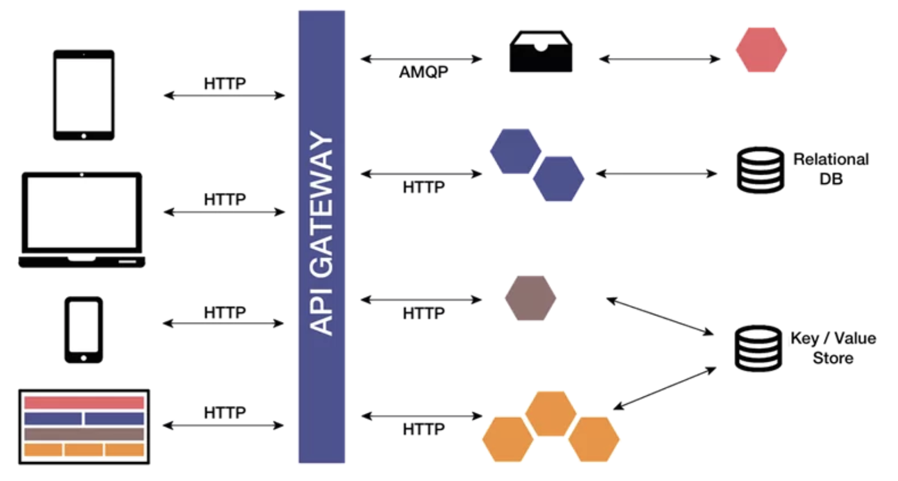

% Service Mesh Architecture
% Blacksmiths: Consul 100 Workshop
% March 2023

## In this Section... 
- Understanding Microservice Archtiecture
- Microservice Examples
- Service Mesh Architecture

---
## What's a Microservice?

---
## Defining Microservices and MS Architecture
- microservice definition
- microservice history (better lighter faster java)
- key microservice benefits
  - lighter weight
  - easier to maintain
  - fewer operational dependencies
  - more flexibility than with a monolith

---

## Microservice Design fundamentals
- todo: highlight the importance of cloud native principals for microservices... and how well service mesh supports these goals...which indicates ease/difficulty of application or portfolio adoption of smesh  
   - these are guidlelines for cloud native (key for microservices)
   - service mesh supports these goals (security, observability, discoverability)
   - lots of extra work to adopt service mesh if you're NOT following cloud native guidlines
- todo: find "7 missing factor from 12 factor application" (Shikha Srivastava) for more guildelines

---

## Understanding Microservice Archtiecture (Example)

---

## Understanding Microservice Archtiecture
- item 1
- item 2
- item 3
- item 4

---

## Microservices Resources
- Building Microservices (Sam Newman)
- Microservices Patterns (Chris Richardson)
- microservices.io (Chris Richardson's blog)
- Microservices: a practical guide (Eberhard Wolff)
- todo: find a resource from martin fowler

---

## Service Mesh Architecture 

---
## Service Mesh Architecture
- item 1
- item 2
- item 3

